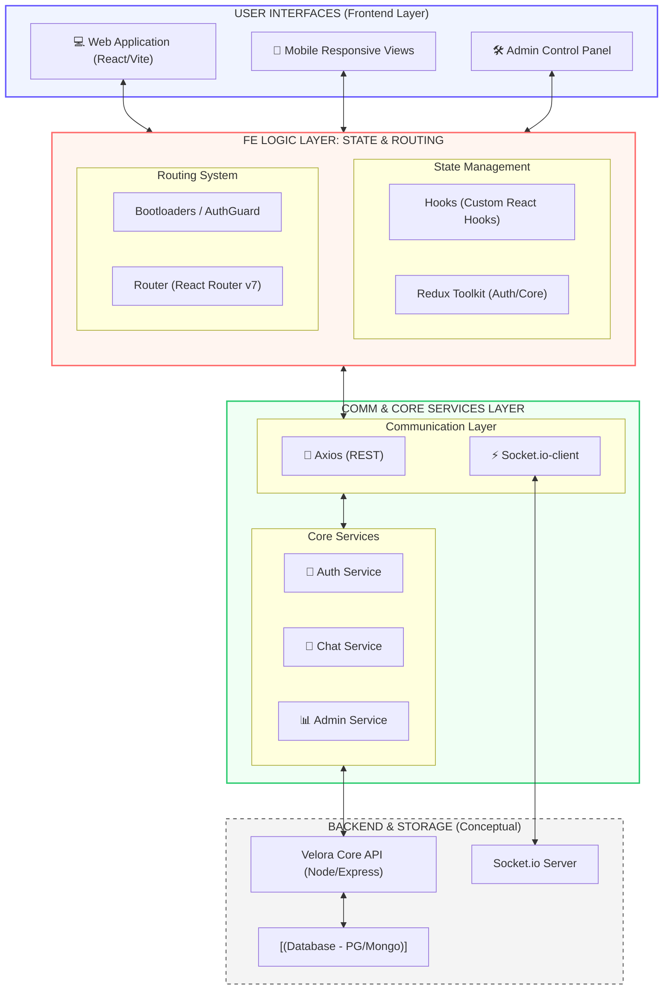

# Velora Web — Full Stack Messenger & Core

## 📐 Architecture Overview
The following diagram illustrates the high-level architecture of the Velora Core system, showcasing the interaction between the React frontend, real-time communication layers, and backend services.



---

## 🚀 Project Overview
**Velora Web** is a premium, high-performance communication platform designed for real-time interaction and administrative control. Built with a modern React stack, it offers a cinematic user experience inspired by industry-leading messenger applications.

### ✨ Key Features
- **Real-time Messenger**: Instant messaging with support for favorites, contacts, and community groups.
- **Admin Dashboard**: Comprehensive management suite for monitoring network activity, user metrics, and system status.
- **Status & Updates**: Story-like status updates and channel exploration.
- **Advanced State Management**: Powered by Redux Toolkit for seamless data flow and authentication.
- **Responsive Design**: Fluid transitions and layouts optimized for both desktop and mobile devices.

### 🛠️ Technology Stack
- **Core**: React 19 (Vite)
- **State**: Redux Toolkit + React Hooks
- **Routing**: React Router v7
- **Communication**: Socket.io-client & Axios
- **Styling**: Vanilla CSS (Custom System)

---

## 🛠️ Getting Started

### Prerequisites
- Node.js (v18+)
- npm or yarn

### Installation
1. Clone the repository
   ```bash
   git clone https://github.com/Abdullah-819/Velora-Web.git
   ```
2. Install dependencies
   ```bash
   npm install
   ```
3. Create a `.env` file and add your environment variables.
4. Start the development server
   ```bash
   npm run dev
   ```

---

## 👨‍💻 Development
The project follows a feature-based architecture:
- `src/features`: Logic and state for specific features (chat, auth, admin).
- `src/pages`: Main view components.
- `src/services`: Integration with external APIs and WebSockets.
- `src/components`: Shared UI components (Button, LoadingSpinner, EmptyState, Skeleton).

---

## 🤝 Contributing
Contributions are welcome! Please read our [Contributing Guide](CONTRIBUTING.md) and [Code of Conduct](CODE_OF_CONDUCT.md) before submitting a pull request.

## 📄 License
This project is licensed under the MIT License - see the [LICENSE](LICENSE) file for details.

---
*Designed with ❤️ by the Velora Development Team*
